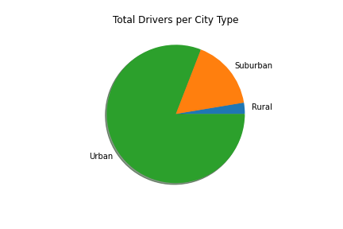
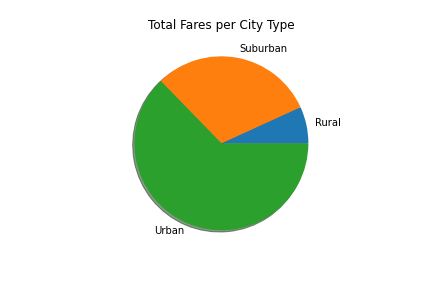
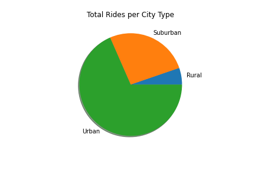
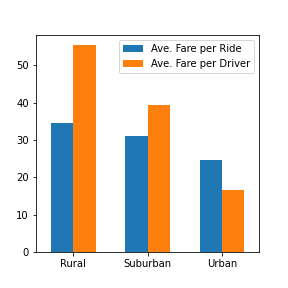
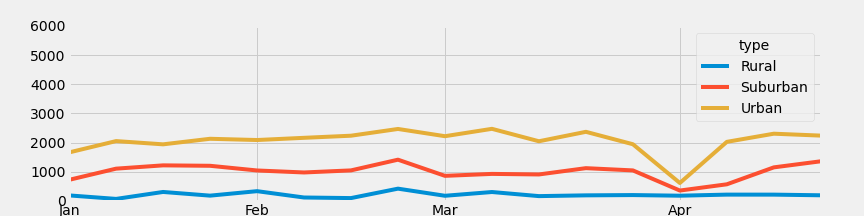

# PyBer_Analysis

## Overview of Analysis
The purpose of this analysis is to compare and contrast the nature of rides taken from a RideShare app, as they fall into categories of the type of city: Urban, Suburban, and Rural.

## Results
There were vast differences in the rides taken from the RideShare app based on type of city.  The vast majority of the rides were taken in Urban locales; the vast majority of all Drivers were located in Urban locales; the vast majority of all fares collected were collected in Urban localed.  See these three Pie Charts, all showing the large Urban percentage of totals...

However, the Fares were a different story.  The average fares were higher for Rural locales, both when considered versus total number of rides, and versus total number of drivers -->

## Summary
There was one datapoint that stuck out very strongly in our analysis.  The first week of April, 2019, saw a huge drop in Fares:

The CEO of PyBer would do well to analyze this week more closely to see if she can ascertain what happened here, especially in Urban and Suburban city types.  The Rural cities were actually not affected by whatever happened during the first week of April.

The CEO of PyBer might do well to increase the number of new Drivers in Rural areas. As shown above, in the Results section, Rural Fares, on average, are higher for Drivers.  This should be touted in any advertisements to potential new Drivers.

The CEO of PyBer may want to consider offering an incentive to Drivers in Urban locales.  In those cities, we showed above that Drivers collect less Fare per Ride, and less per Driver. The incentive might be for Urban Drivers to temporarily relocate to Rural areas before they begin their driving.  This would increase the total number of Drivers in Rural areas, which is low, whilst at the same time, it may increase the Average Fare being collected by the Driver.

